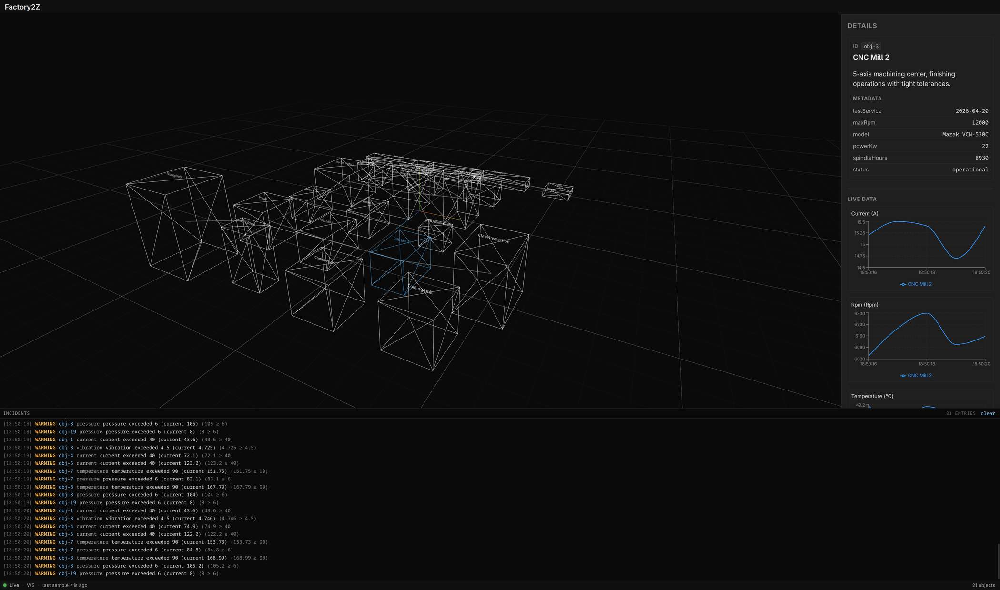
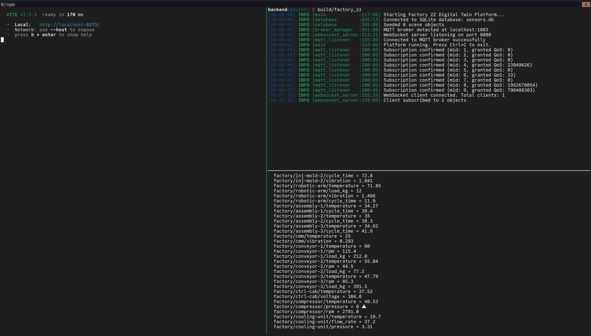

# factory-2z

A real-time factory monitoring platform with digital twins and anomaly detection.



## Tech Stack

| Component | Technology |
|-----------|------------|
| Frontend | React + TypeScript + Vite |
| 3D Engine | Three.js via React Three Fiber + Drei |
| Backend | C++ with CMake |
| Realtime | WebSocket (UI communication), MQTT (sensor data) |
| Database | SQLite |
| C++ Style | LLVM |

## Dependencies

### Fedora

Install the required packages:

```bash
sudo dnf install cmake gcc-c++ make
sudo dnf install mosquitto-devel  # For MQTT client library (or we fetch via CMake)
sudo dnf install sqlite-devel     # SQLite development files
```

Note: The CMake build will automatically fetch mosquitto, jsoncpp, uWebSockets, and sqlpp11 via FetchContent. System libraries (sqlite) must be installed.

### Building

```bash
cd backend
mkdir build && cd build
cmake ..
make -j
```

### Configuration

Create a `config.json` in the backend directory (or adjust path in code):

```json
{
  "database": {
    "path": "sensors.db"
  },
  "websocket": {
    "port": 8080
  },
  "mqtt": {
    "broker_port": 1883,
    "client_id": "factory_2z_listener"
  }
}
```



